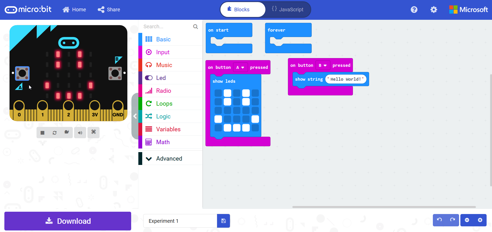
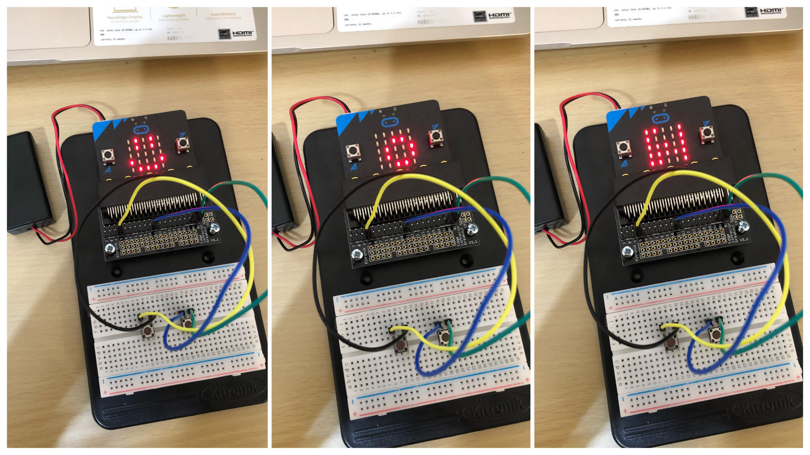
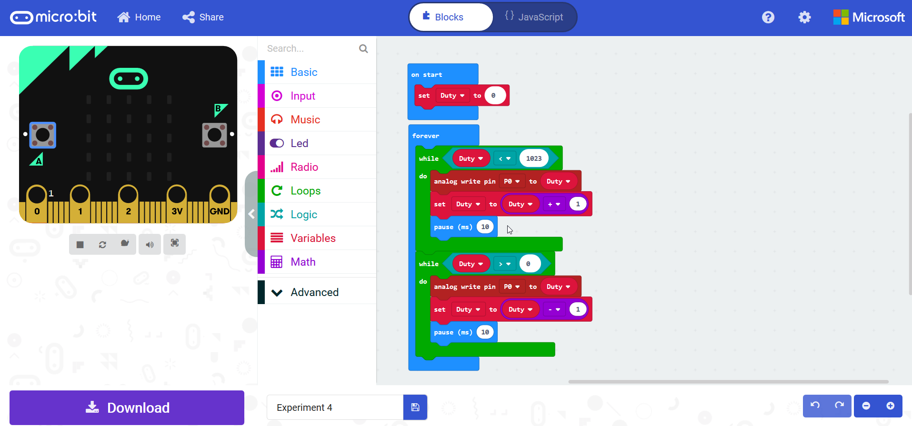
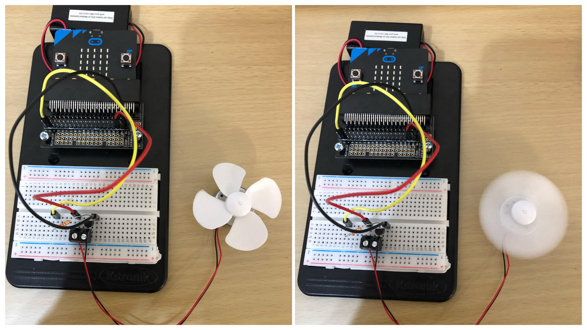
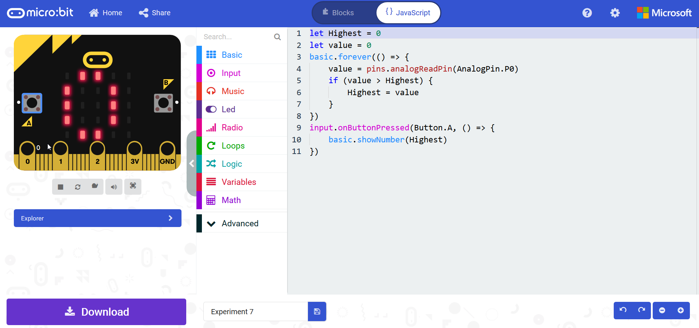
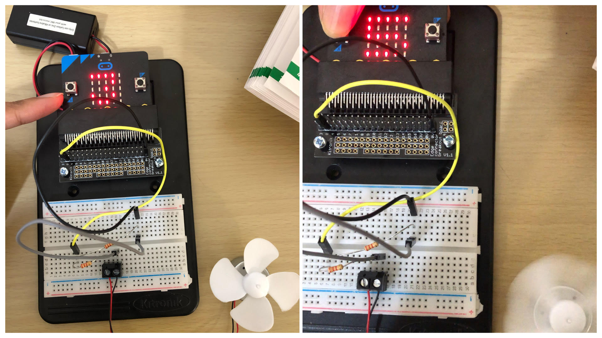
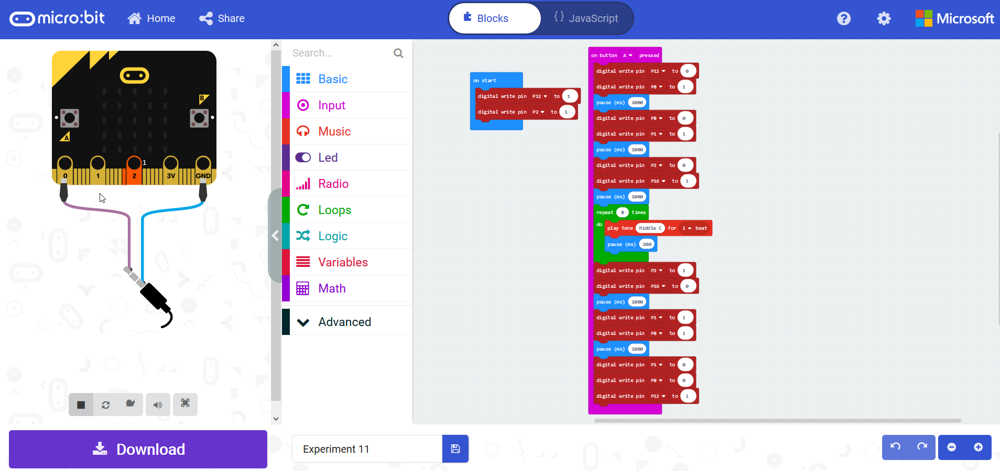
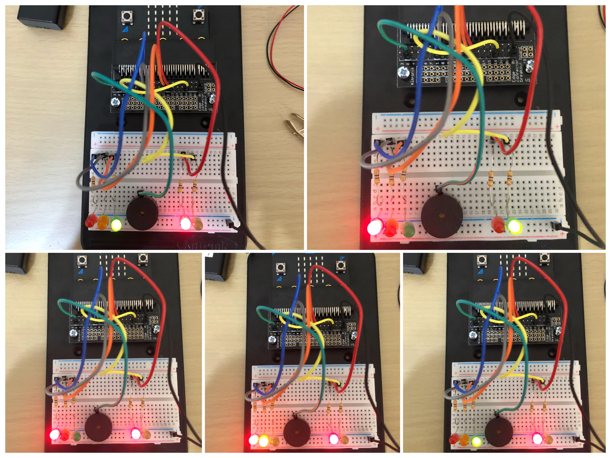
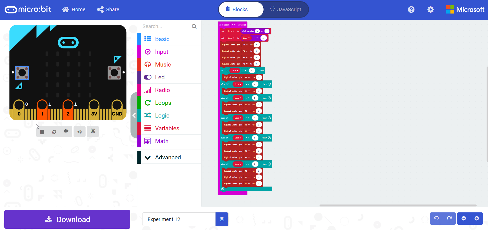
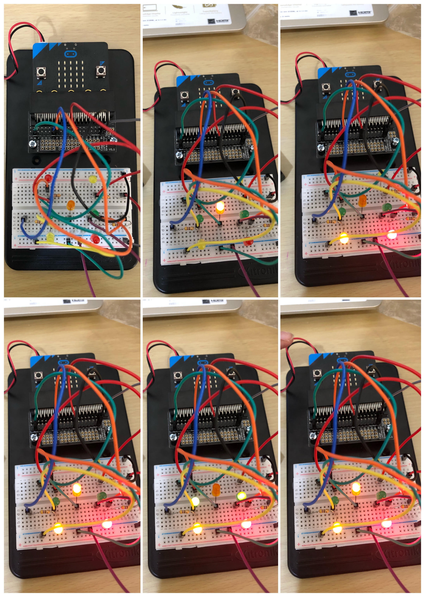

# Inventor Kit Experiments

*Markdown reference: https://guides.github.com/features/mastering-markdown/*

## Instructions ##

*For a selection of 5 inventor kit experiments that you choose, fill out the following sections.

### Say Hello to the BBC MicroBit ###

#### Photo of completed project ####

(Familiarising myself with the Microbit)

#### Reflection ####

In this experiment, I learnt what a Microbit is and learnt how to execute and display an image on the BBC using buttons on the microbit and saw how I could use the bread board to access these buttons externally using the supplied buttons. I also familiarised myself with the breadboard in this experiment as I had never used one before. I learnt how they are designed to work with through-hole electronic components to prototype an electronic circuit. As I am new to electronics, I found the breadbaord extremeely useful as the connections are not permanent, so it was easy to remove a component if I had made a mistake. I aslo familiarised myself with the Microsoft Makecode Editor. This was easy to use becasue of the drag and drop feature so it made it easier to understand the code that was being executed as part of the circuit.

This experiment could be the basis of a real world application such as (insert something here).

### Using a Transistor to Drive a Motor ###

#### Photo of completed project ####
In the code below, replace imagemissing.jpg with the name of the image, which should be in the kitexperiments folder.

Experimenting with a motor

#### Reflection ####777

In this experiment, I learnt about how fan motors are used on Microbits and how to control it's speed via a transistor. I observed that the motor after a few seconds started to spin slowly, then faster until it reached miximum speed, until at this point it slowed down and came to a stop then repeated the process. This also made me aware of the Duty Cycle diagram and how the volts changed at different speeds. During the experiment I learnt that if a transistor is turned on and off very quickly and it spends it's time on and half its time off then the fan motor will spin at half speed. So when I changed the parcentage of the time the transistor spends on, the speed of the motor could be finely controlled. I also learnt about the Pulse Width Modulations (PMW) process which explains how the widths of the pulses are controlled if the pulse is either on or off. Therefore, this means that the PWM varies the volatage and controls the speed of the fan motor. 

This experiment could be the basis of a real world application such as (insert something here).

### Wind Power ###

(Replace this with the experiment name)

#### Photo of completed project ####
In the code below, replace imagemissing.jpg with the name of the image, which should be in the kitexperiments folder.

(Insert a caption here)

#### Reflection ####

In this experiment, something new to me was or something I learned was (insert something here).

This experiment could be the basis of a real world application such as (insert something here).

### Making a Pedestrian Crossing ###

(Replace this with the experiment name)

#### Photo of completed project ####
In the code below, replace imagemissing.jpg with the name of the image, which should be in the kitexperiments folder.

(Insert a caption here)

#### Reflection ####

In this experiment, something new to me was or something I learned was (insert something here).

This experiment could be the basis of a real world application such as (insert something here).

### Making a Random Dice ###

(Replace this with the experiment name)

#### Photo of completed project ####
In the code below, replace imagemissing.jpg with the name of the image, which should be in the kitexperiments folder.

(Insert a caption here)

#### Reflection ####

In this experiment, something new to me was or something I learned was (insert something here).

This experiment could be the basis of a real world application such as (insert something here).

