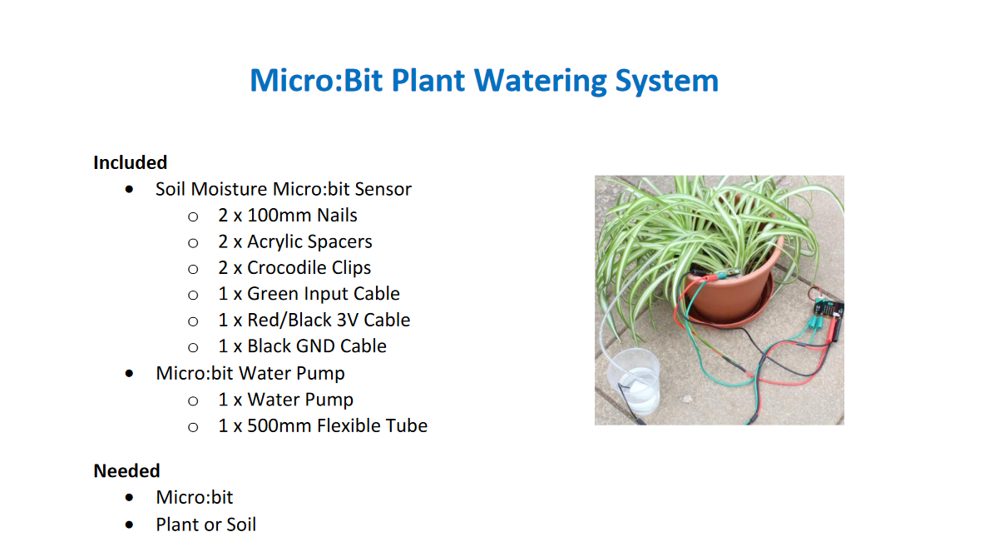
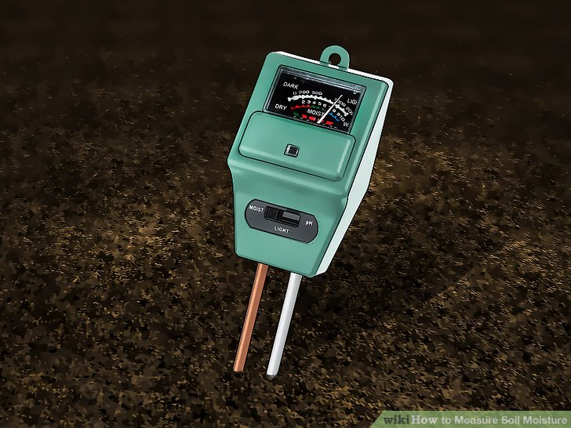
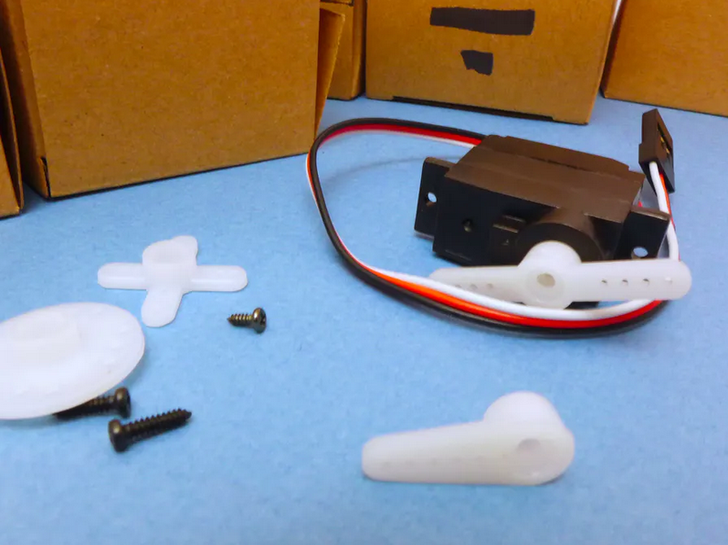
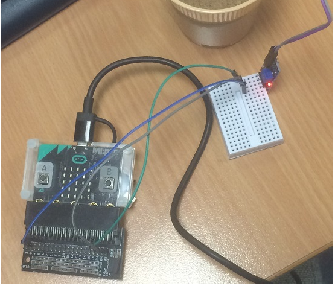
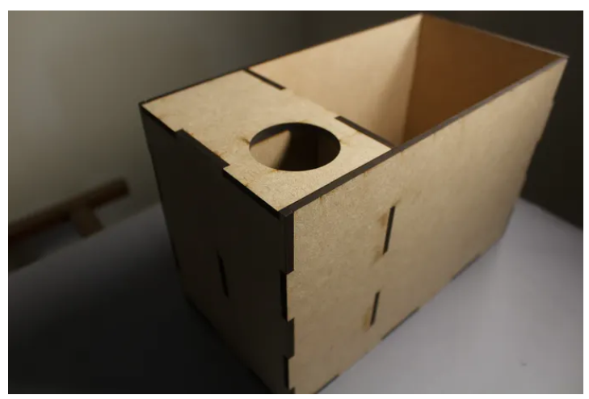
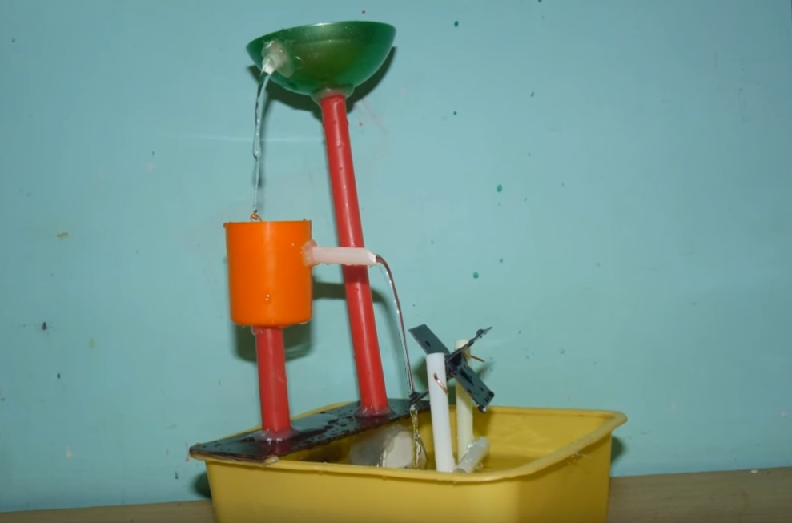

# Assessment 1: Replication project

*Markdown reference:* [https://guides.github.com/features/mastering-markdown/](http://guides.github.com/features/mastering-markdown/)

## Replication project choice ##
Plant Watering

## Related projects ##

### Related project 1 ###
Micro:bit Plant Watering System

https://sciencescope.uk/wp-content/uploads/2017/08/MicroBit-Plant-Watering-System-User-Instructions-V2.pdf

This project is related to mine because the outcome is also to create a self watering plant. Even though this project is the same, I wanted to explore the materials used and their method in creating the self watering plant. However, in this project, they used a Microbit water pump negating the need to make a physical mechanism to water the plant. 

### Related project 2 ###
Soil Moisture Probe

https://www.edaphic.com.au/products/soils/moisture-sensors-probes-and-meters/

This project is related to mine because the soil moisture probe is a device that is made to read and measure soil moisture quantity. Once the probe has effectively assessed the moisture level of the soil, a number should pop up on the display area if a digital probe is being used. This is similar becasue in my project, I will also be using the Microbit to digitally display the soil moisture quantity. However, I will be setting a number range to determine whether the soil's moisture is sufficient. 

### Related project 3 ###
Servo Basics

https://create.arduino.cc/projecthub/glowascii/servo-arduino-basics-cb9266?ref=search&ref_id=servo%20180&offset=1

This project is related to mine because its aim is to be able to point the servo motor in a specific direction or turn by degrees, the same way the aim of my project is to turn the motor in a direction to collect water and water the plant. This project also creates conditions in which the servo motor is able to turn. I also plan on implementing conditions in my code so that the servo motor can turn according to what has been set.

### Related project 4 ###
Water Sesnor
http://www.multiwingspan.co.uk/micro.php?page=water

This project relates to mine because this project is using a soil moisture level sensor and as seen in the photograph above, the project makes use of the breadboard to connect the sensor. I wanted to see how they made use of the sensor and breadboard. I also observed which pins they used; 3V, GND and A0 to pin 0. Another thing that was pointed out in the project was the challenges faced during the process. These were recorded;
“Things that make a difference to your reading, like the amount of and type of soil, where you pour the water. The variable in your experiment is the amount of water. You need to run the experiment many times with different volumes of water. Everything else in your experiment needs to be the same each time you take a reading. In between each trial, wipe and dry the sensor and your container.” 
I found this helpful for my project because it made me aware of certain things I should be cautious of when creating the project and made me aware of how exactly I should set-up my mechanisms to take accurate readings. 

### Related project 5 ###
Modern Laser Cut Plant Container 

https://create.arduino.cc/projecthub/JontyDIY/sprout-modern-indoor-self-watering-planter-3eefaf

This project is related to mine because again, although it's also another version of a self watering plant, I exploored this project to observe the fabrics and materials used for the aesthetics of the self watering plant. I liked how clean cut the vase of the self-watering plant looked and I liked it's ability to hide the wires appropriately. 

### Related project 6 ###
Small Table Top Water Fountain

https://www.youtube.com/watch?v=f6sj2Ddx3Ws

I chose to look into this project because I thought it was an interesting way of combining the function of a water fountain and the aesthetics of the way the water runs through the fountain. I would like to attempt this type of aesthetic for my self watering plant if I have access to the right materials. The challenging part would be trying to combine the functionality of the servo motor picking up water and then dropping it into the soil. 

## Reading reflections ##

### Reading: Don Norman, The Design of Everyday Things, Chapter 1 (The Psychopathology of Everyday Things) ###

*What I thought before:* Before reading this paper, I was unaware of what affordances exactly were and had thought that each object had a known purpose or a specific intention.

*What I learned:* I learnt about the powerful relationship that exists between man and ‘things’ whether it be through experience or some innate ability, we are capable of assessing objects according to their perceivable properties. This changed my perception on what I know of design experience and how interpretations of things allow us to both determine an object’s possible uses and analyse how they might help us to achieve our aims and objectives. I’ve also learnt about how feedback responses from an object can also determine whether the object succeeds or fails when interacting with it.

*What I would like to know more about:* I would be interested in further broadening my knowledge in the types of feedback objects respond with and would like to understand to what level a user finds feedback either helpful or unhelpful. 

*How this relates to the project I am working on:* This article relates to my project because it introduces me to think more broad about the intentions of my self watering plant project. For example, I might be creating this project with a purpose in mind but there may be other misleading signifiers that have not been picked up on as a designer. My project might require instructions to know how to interact with it otherwise it may be confusing for others starting out with my self watering plant. If I were to turn this project into a full feasible product I would have to think about how the users will interact with it and at what lengths would I be required to design not just a product but a user experience too. 
 

### Reading: Chapter 1 of Dan Saffer, Microinteractions: Designing with Details, Chapter 1 ###

*What I thought before:* Before reading this chapter, I was always under the impression that micro-interactions were the same as features and that features of a product are things that draw consumers towards a product. 

*What I learned:* This chapter definitely changed my knowledge on the importance of micro-interactions. Micro-interactions challenge designers to see how lightweight they can design, to reduce complexity and streamline features that could otherwise be burdensome. I also learnt that the intertwined history of interaction design and human computer interaction is really the history of micro-interactions. 

*What I would like to know more about:* I would like to know more about designing micro-interactions because I aspire to work in a field of user experience and would like to grow my knowledge on the different types of micro-interactions that have appeared over time and the difference its made to consumers interacting with the product.

*How this relates to the project I am working on:* This chapter relates to my project because my project is also made up of micro-interactions. According to the reading, micro-interactions are structured into 4 segments including; trigger, rules, feedback and loops and modes. My project (self watering plant) follows the same structure where a reading is taken of the soil moisture, if the reading detects no moisture in the soil there is a trigger to follow a rule to fill the soil with water. Once the rule is executed the microbit measures the soil moisture again and provides feedback. If the soil still requires moisture then the process is repeated until a condition has been met.

### Reading: Scott Sullivan, Prototyping Interactive Objects ###

*What I thought before: Describe something that you thought or believed before you read the source that was challenged by the reading.*

*What I learned: Describe what you now know or believe as a result of the reading. Don't just describe the reading: write about what changed in YOUR knowledge.*

*What I would like to know more about: Describe or write a question about something that you would be interested in knowing more about.*

*How this relates to the project I am working on: Describe the connection between the ideas in the reading and one of your current projects or how ideas in the reading could be used to improve your project.*

## Interaction flowchart ##
*Draw a flowchart of the interaction process in your project. Make sure you think about all the stages of interaction step-by-step. Also make sure that you consider actions a user might take that aren't what you intend in an ideal use case. Insert an image of it below. It might just be a photo of a hand-drawn sketch, not a carefully drawn digital diagram. It just needs to be legible.*

## Process documentation

*In this section, include text and images that represent the development of your project including sources you've found (URLs and written references), choices you've made, sketches you've done, iterations completed, materials you've investigated, and code samples. Use the markdown reference for help in formatting the material.*

*This should have quite a lot of information!*

*There will likely by a dozen or so images of the project under construction. The images should help explain why you've made the choices you've made as well as what you have done. Use the code below to include images, and copy it for each image, updating the information for each.*

*Include screenshots of the code you have used.*

## Project outcome ##

*Complete the following information.*

### Project title ###

### Project description ###

*In a few sentences, describe what the project is and does, who it is for, and a typical use case.*

### Showcase image ###

*Try to capture the image as if it were in a portfolio, sales material, or project proposal. The project isn't likely to be something that finished, but practice making images that capture the project in that style.*

### Additional view ###

*Provide some other image that gives a viewer a different perspective on the project such as more about how it functions, the project in use, or something else.*

### Reflection ###

*Describe the parts of your project you felt were most successful and the parts that could have done with improvement, whether in terms of outcome, process, or understanding.*

*What techniques, approaches, skills, or information did you find useful from other sources (such as the related projects you identified earlier)?*

*What ideas have you read, heard, or seen that informed your thinking on this project? (Provide references.)*

*What might be an interesting extension of this project? In what other contexts might this project be used?*
