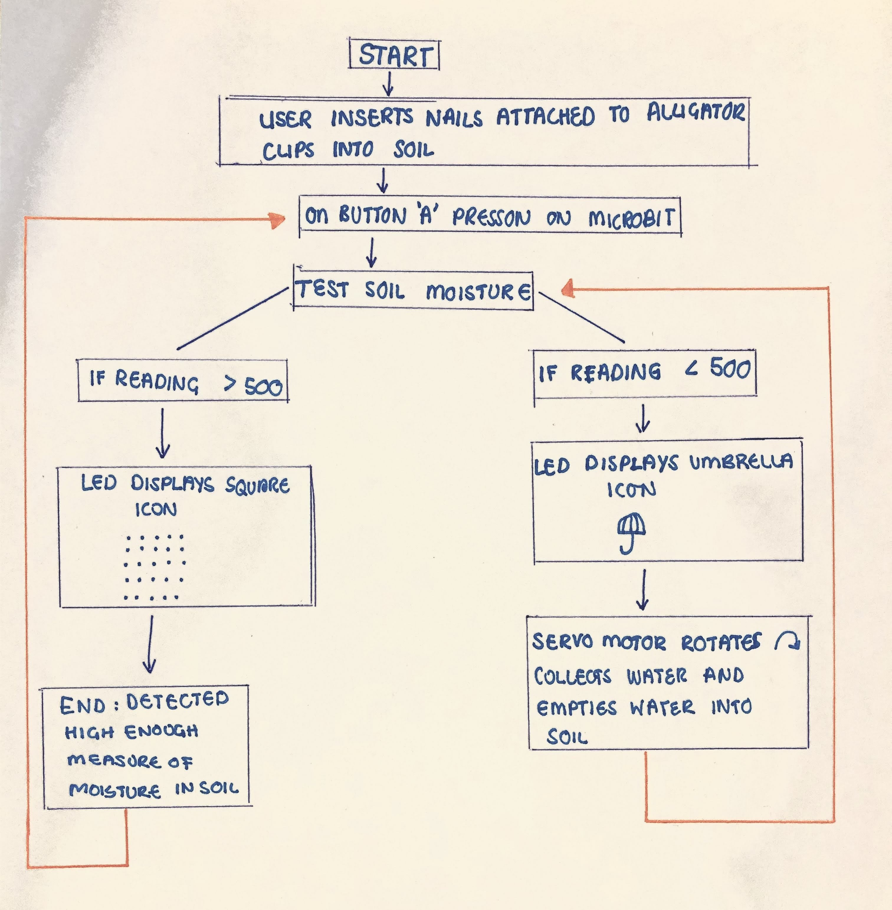

# Assessment 1: Replication project

*Markdown reference:* [https://guides.github.com/features/mastering-markdown/](http://guides.github.com/features/mastering-markdown/)

## Replication project choice ##
Plant Watering

## Related projects ##

### Related project 1 ###
Micro:bit Plant Watering System

https://sciencescope.uk/wp-content/uploads/2017/08/MicroBit-Plant-Watering-System-User-Instructions-V2.pdf

This project is related to mine because the outcome is also to create a self watering plant. Even though this project is the same, I wanted to explore the materials used and their method in creating the self watering plant. However, in this project, they used a Microbit water pump negating the need to make a physical mechanism to water the plant. 

### Related project 2 ###
Soil Moisture Probe

https://www.edaphic.com.au/products/soils/moisture-sensors-probes-and-meters/

This project is related to mine because the soil moisture probe is a device that is made to read and measure soil moisture quantity. Once the probe has effectively assessed the moisture level of the soil, a number should pop up on the display area if a digital probe is being used. This is similar becasue in my project, I will also be using the Microbit to digitally display the soil moisture quantity. However, I will be setting a number range to determine whether the soil's moisture is sufficient. 

### Related project 3 ###
Servo Basics

https://create.arduino.cc/projecthub/glowascii/servo-arduino-basics-cb9266?ref=search&ref_id=servo%20180&offset=1

This project is related to mine because its aim is to be able to point the servo motor in a specific direction or turn by degrees, the same way the aim of my project is to turn the motor in a direction to collect water and water the plant. This project also creates conditions in which the servo motor is able to turn. I also plan on implementing conditions in my code so that the servo motor can turn according to what has been set.

### Related project 4 ###
Water Sesnor
http://www.multiwingspan.co.uk/micro.php?page=water

This project relates to mine because this project is using a soil moisture level sensor and as seen in the photograph above, the project makes use of the breadboard to connect the sensor. I wanted to see how they made use of the sensor and breadboard. I also observed which pins they used; 3V, GND and A0 to pin 0. Another thing that was pointed out in the project was the challenges faced during the process. These were recorded;
“Things that make a difference to your reading, like the amount of and type of soil, where you pour the water. The variable in your experiment is the amount of water. You need to run the experiment many times with different volumes of water. Everything else in your experiment needs to be the same each time you take a reading. In between each trial, wipe and dry the sensor and your container.” 
I found this helpful for my project because it made me aware of certain things I should be cautious of when creating the project and made me aware of how exactly I should set-up my mechanisms to take accurate readings. 

### Related project 5 ###
Modern Laser Cut Plant Container 

https://create.arduino.cc/projecthub/JontyDIY/sprout-modern-indoor-self-watering-planter-3eefaf

This project is related to mine because again, although it's also another version of a self watering plant, I exploored this project to observe the fabrics and materials used for the aesthetics of the self watering plant. I liked how clean cut the vase of the self-watering plant looked and I liked it's ability to hide the wires appropriately. 

### Related project 6 ###
Small Table Top Water Fountain

https://www.youtube.com/watch?v=f6sj2Ddx3Ws

I chose to look into this project because I thought it was an interesting way of combining the function of a water fountain and the aesthetics of the way the water runs through the fountain. I would like to attempt this type of aesthetic for my self watering plant if I have access to the right materials. The challenging part would be trying to combine the functionality of the servo motor picking up water and then dropping it into the soil. 

## Reading reflections ##

### Reading: Don Norman, The Design of Everyday Things, Chapter 1 (The Psychopathology of Everyday Things) ###

*What I thought before:* Before reading this paper, I was unaware of what affordances exactly were and had thought that each object had a known purpose or a specific intention.

*What I learned:* I learnt about the powerful relationship that exists between man and ‘things’ whether it be through experience or some innate ability, we are capable of assessing objects according to their perceivable properties. This changed my perception on what I know of design experience and how interpretations of things allow us to both determine an object’s possible uses and analyse how they might help us to achieve our aims and objectives. I’ve also learnt about how feedback responses from an object can also determine whether the object succeeds or fails when interacting with it.

*What I would like to know more about:* I would be interested in further broadening my knowledge in the types of feedback objects respond with and would like to understand to what level a user finds feedback either helpful or unhelpful. 

*How this relates to the project I am working on:* This article relates to my project because it introduces me to think more broad about the intentions of my self watering plant project. For example, I might be creating this project with a purpose in mind but there may be other misleading signifiers that have not been picked up on as a designer. My project might require instructions to know how to interact with it otherwise it may be confusing for others starting out with my self watering plant. If I were to turn this project into a full feasible product I would have to think about how the users will interact with it and at what lengths would I be required to design not just a product but a user experience too. 
 

### Reading: Chapter 1 of Dan Saffer, Microinteractions: Designing with Details, Chapter 1 ###

*What I thought before:* Before reading this chapter, I was always under the impression that micro-interactions were the same as features and that features of a product are things that draw consumers towards a product. 

*What I learned:* This chapter definitely changed my knowledge on the importance of micro-interactions. Micro-interactions challenge designers to see how lightweight they can design, to reduce complexity and streamline features that could otherwise be burdensome. I also learnt that the intertwined history of interaction design and human computer interaction is really the history of micro-interactions. 

*What I would like to know more about:* I would like to know more about designing micro-interactions because I aspire to work in a field of user experience and would like to grow my knowledge on the different types of micro-interactions that have appeared over time and the difference its made to consumers interacting with the product.

*How this relates to the project I am working on:* This chapter relates to my project because my project is also made up of micro-interactions. According to the reading, micro-interactions are structured into 4 segments including; trigger, rules, feedback and loops and modes. My project (self watering plant) follows the same structure where a reading is taken of the soil moisture, if the reading detects no moisture in the soil there is a trigger to follow a rule to fill the soil with water. Once the rule is executed the microbit measures the soil moisture again and provides feedback. If the soil still requires moisture then the process is repeated until a condition has been met.

### Reading: Scott Sullivan, Prototyping Interactive Objects ###

*What I thought before:* Before reading this article I used to think that making digital products was only built for developers but after reading the experience of the user in the article, I feel as though I could potentially build my own digital products as a designer once I understand the fundamentals of technology. 

*What I learned:* I learned about the physical prototyping techniques that could ultimately change the way a product is created. These techniques are essential to every designer who may or may not be familiar with physical prototyping or have technical skills but are essential to expanding our knowledge and capabilities in the field of emerging design. For example, an interaction so small could be challenged with back and forth digital prototyping but the end result could be far greater than perceived. 

*What I would like to know more about:* I myself, also feel quite intimidated by emerging technologies as I find it hard to understand code and have trouble with digital tools. Therefore, I’d like to explore more projects that require digital prototyping to up-skill in the field of technology. 

*How this relates to the project I am working on:* This relates to the project I’m working on because I am also making use of a micro-controller (Micro-bit). In terms of watering a plant, a user would have to manually fill up a water and then pour the water into the soil for the plant to grow. My project takes the nuisance and time out of the process and relies on a microbit to water the plant. Just like the reading, the project is based off a simple interaction but when automated, creates an effective solution for the user and their experience. 

## Interaction flowchart ##

## Process documentation

I first started off this project by familiarising myself with the example self-watering plant project on MakeCode. I observed the use of materials and the way the project was constructed. The video demonstrated how the self-watering plant functioned and how the Microbit used took a reading of the soil moisture.
I decided to try out the experiment exactly as seen in the MakeCode example. However I was interested in adding my own element to it. I wanted to add a buzzer noise that would align with the moment the Microbit detected that the moisture in the soil was low. In MakeCode, I added the ‘playtone Middle C’ function to the statement that conditioned the Microbit to display an umbrella icon (moisture reading < 500). I exported the code and trialled it on the Microbit. I set up my Microbit to work off a breadboard as I felt that this was easier. On trial, the buzzer noise was working, however the servo motor was not spinning at all.

I assumed that I had done something wrong in my code and came back to try and see where I had gone wrong. I tried multiple times to adjust my code but could not figure out where I had made a mistake. I then looked at my wiring.

I realised I had not put the correct wires to the correct place on the servo motor. I changed my wiring to darkest to GND, yellow to P2 and Red to 3V. 
Now that I changed the wiring, I tested the experiment again. This time I could hear the buzzer at the right moment ( moisture reading < 500) and I could hear the cogs of the servo motor making noise but the servo motor was still not spinning. 
I went to check my wiring again. From what I could see- I had attached a wire for the buzzer on P0 and a wire for the alligator clip. Therefore I had two wires for different instances connecting to P0. 

I had then come to the conclusion that because I had two wires connecting to P0 that maybe the system was getting confused. However, I still did not understand why the servo wheel was not spinning even though I could hear the cogs trying to move.
I decided to do a test just on the servo motor to see if the servo motor was working properly on its own. I created a simple code on a forever loop to test it.

On its test run, the servo motor was still not spinning, which meant that there was something wrong with the servo motor itself. I had researched the causes on an online blog forum and had seen a few people that were suggesting to possibly replace the batteries of the Microbit. I decided to try this out and re-tested the servo motor again. To my surprise, the servo motor began to spin.

Unfortunately I still could not figure out the reason for why the buzzer and servo motor could not perform its functions at the same time. I decided that I would remove the buzzer from the project and do more research on it before adding it back into the project. 
Initially I had wanted to create a water/ plant fountain that would still perform the same function as a self-watering plant as seen in the image below. Although due to the whole COVID-19 working from home transition, I was limited to getting access to the materials I wanted to create my water/plant fountain. So, I had to make do with the materials I had at home and decided to create the physical prototype. 

I found a few materials that I thought would work and began to construct my self-watering plant. I then tested the prototype out with my code.

As seen in the image above, the function (code) executed well but the straw rotated a bit too far and missed the ‘vase’ completely. I decided that I would try and decrease the degree of rotation so that it would reach the angle of where the plant was. 

As seen in the image above, each file highlights the degree of rotation I had experimented with. The change of degrees seemed to work for the most part, but the straw would always land straight back down in the position mentioned in the first trial. I fidgeted around a bit more with the servo motor rotation and was still not pleased with the angle it was rotating in. At some points the straw would rotate perfectly until it would rotate back again to its starting position but then get stuck mid-way in the actual ‘vase’. I also had to play around with the lengths and angles of the straw so that it would; collect enough water droplets and not hit the edge of the vase on rotation.
I found this part of the prototyping and experimentation phase very time consuming as each change I made on the MakeCode Editor had to be saved, exported and then trialled out on the Microbit. 
I realised that maybe the problem that I was facing was not to do with the servo motor rotations but with the actual physical vases. 

The problems with the vases were;
1)	The vase with the water inside had a small diameter which meant that it was hard for the straw to smoothly rotate without hitting the edge each time;
2)	The vase with the water inside was taller than the vase with the plant inside which kept interfering with the rotations of the straw. It would have been better if the two vases were of the same height. 
I then decided to trial out another prototype and this time I changed the vase. Again, I did not have access to the types of materials I wanted so I had to find materials at home that would satisfy the next prototype.
I was lucky to have found a container that was of the same height. I proceeded to fill one side up with water and one side up with soil and re-fitted my servo motor on the edge that separated the two sides. 
I re-tested my code again. Alas! It worked this time without me having to adjust anything majorly. 

## Project outcome ##

### Self Watering Plant ###

### Project description ###

*In a few sentences, describe what the project is and does, who it is for, and a typical use case.*

### Showcase image ###

I would have liked to have presented it in a better way with better materials but again, I was limited with access to materials and had to make do with what I had.

### Reflection ###

*Describe the parts of your project you felt were most successful and the parts that could have done with improvement, whether in terms of outcome, process, or understanding.*

*What techniques, approaches, skills, or information did you find useful from other sources (such as the related projects you identified earlier)?*

*What ideas have you read, heard, or seen that informed your thinking on this project? (Provide references.)*

*What might be an interesting extension of this project? In what other contexts might this project be used?*
